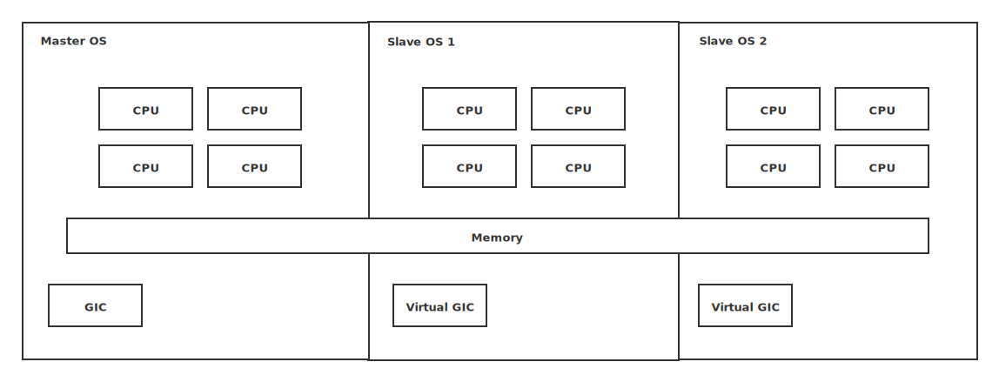
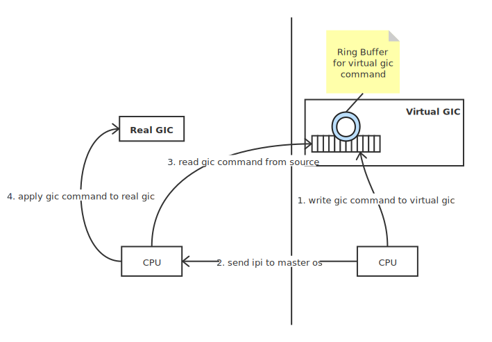

Dysche整体框架
---

Dysche本质上是一种部分虚拟化的策略。相较于当前虚拟化中，将全部硬件虚拟化，分配给多个OS使用。Dysche仅将一些无法直接供给多个OS使用的硬件进行虚拟化，其他硬件则不做虚拟化。从运行效率来说，Dysche有天然的优势。

为了支持相关策略，MasterOS需要拥有如下基本能力
1. Master OS 预留出对应硬件资源
2. Master OS 拥有能力从剩余的硬件中拉起其他二进制系统

这里，将Linux作为基础的Master OS，需要添加相关的能力到Linux。整个其中最基本的CPU和内存资源可以逻辑划分，几个OS独立使用。但是对于一般架构的很多设备，设备操作是有上下文的，不能交予每个OS独立使用,需要适度的虚拟化。因此，对于每个OS，会有部分硬件资源为真实硬件资源，另外一部分为虚拟资源。

Dysche最终目标为支持运行所有类型设备，当然这个愿景是长期的，不能一蹴而就。

以下是从产出可视化的角度，规划几个阶段的任务：

# Slave分区——支持纯计算业务

为了维持纯计算业务的正常运行，仅需要CPU，内存，中断控制器正常工作。其中CPU和内存使用真实硬件，为最基本的运行条件，（CPU运行级别保持和Master OS一致）；中断相关涉及两个方面的工作，中断配置和中断route及处理，Slave中需要有一个虚拟的中断控制器，完成对时钟中断的配置，而中断route则由真实的中断控制器直接route到真实CPU，交由Slave中系统处理。

该阶段，主要有如下工作：
1. Master资源预留（必须）
2. Master OS拉起Slave OS（必须）
4. Slave OS中虚拟中断控制器（必须）
3. Slave OS独立硬件视图，使用ACPI或者DTB的形式（便于管理，便于后续）
5. Slave OS虚拟串口（便于使用）

PS： 对于虚拟中断控制器，实现时可先不支持MSI中断，设计时应考虑后续扩展支持MSI的可能性。

开发原则
1. 尽量减少对个系统耦合，避免侵入式修改

# Slave分区——支持设备操作

